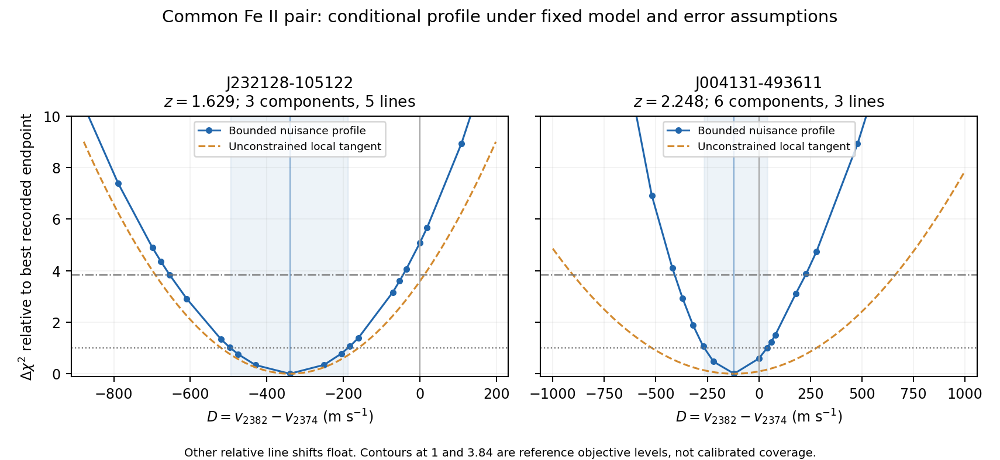

# 两个新档案吸收系统：共同 Fe II 线对的不确定性

这次实际计算了相同观测量 D = v(Fe II 2382) − v(Fe II 2374) 的 nuisance-profile 轮廓。两组数据都能得到数值封闭的条件轮廓；但 J004 的计算发现了此前未找到的更低气体/仪器宽度参数分支，因此不能把最初的局部标准误差直接当作可靠测量精度。

结果仍然只描述指定气体结构、参数边界和误差模型下的相对线位移。仪器残余标定、像素协方差、气体模型选择与原子响应的不确定性没有被完整边缘化，本轮没有证明精细结构常数或宇宙时间律变化。

## Material Passport

- 模式：实际数据上的追加数值检验；原始档案模型和历史结果保持不变。
- 数据：J232128−105122，z=1.629，3 个气体分量/5 条线/130 像素；J004131−493611，z=2.248，6 个气体分量/3 条线/138 像素。
- 权重：SQUAD FITS 主数组 row2 expected fluctuation，仍为对角权重，不是完整协方差。
- 固定：此前选定的谱线、窗口、原始像素、掩膜、分量数和所有边界；像素积分 OS33。
- 独立验证：见 [独立复核](common_pair_independent_review.md) 与 `results/common_pair/review/validation.json`。

## 共同观测量的结果

下表的 profile 区间是实际非线性拟合在 Δχ²=1 处的插值交点，保留了非对称性。它是条件轮廓，并未校准为具有指定覆盖率的置信区间。局部 σ 则允许 nuisance 参数在切空间中双向变化；有硬边界时，它与实际受限 profile 不必一致。

| 目标 | z | D，m/s | 局部切线 σ，m/s | profile Δχ²=1 交点，m/s | profile Δχ²=3.84 交点，m/s |
|---|---:|---:|---:|---|---|
| J232128-105122 | 1.629 | -339.971 | 179.581 | [-495.2, -187.9] | [-654.3, -43.7] |
| J004131-493611 | 2.248 | -120.110 | 399.412 | [-264.9, 40.0] | [-408.7, 227.3] |



图中蓝线为逐点固定 D、重新优化其他参数的实际结果；橙虚线为局部切线近似。阴影表示 Δχ²=1 的插值范围。J004 的受限非线性轮廓与无约束局部近似明显不同，参数硬边界可能贡献了这种差异；尚未将其与非线性及残差曲率的作用分别隔离。较窄的蓝色轮廓不能解释为模型独立的精度提升。

J232 的最佳点有 `zero_2260` 和 `zero_2374` 两个边界活跃；J004 还涉及 `logb_1` 和 `logfwhm_1608`，以及 `zero_2374`。这些结果需要随模型边界一起使用。轮廓只是所检查分支附近的相连范围，不保证找遍所有不相连的似然区域。

## J004 的新参数分支与公平重算

最初从保存的 H0/H1 重新开始自由拟合，仍停在此前 H1 χ²≈104.534 的分支。固定 D≈+189 m/s 的 profile 探索进入更低分支，解除该约束后得到 χ²≈87.255、D≈−120.110 m/s。原始像素、误差和分量数都没有变化；改善来自数值搜索找到新的 nuisance 参数组合。

为公平比较，随后把这组气体参数用于所有相对位移均为零的 H0 重启，并从该 H0 再启动自由 H1。下表是新 companion 中保存的有限终点比较，历史 row2 文件仍保留原值。

| 目标 | 历史 H0 χ² | 历史 H1 χ² | 新 H0 χ² | 新 H1 χ² | 新 Δχ² | 新增位移参数 |
|---|---:|---:|---:|---:|---:|---:|
| J232128-105122 | 75.158887 | 68.998842 | 75.158887 | 68.998842 | 6.160046 | 4 |
| J004131-493611 | 110.035743 | 104.534085 | 95.228461 | 87.254912 | 7.973549 | 2 |

J004 的最佳 D 从历史分支的约 +26 m/s 改为约 −120 m/s，本身表明仅依赖一个成功终止端点并不足以评估精度。新 H0 同样得到明显改善，因此不能把 H1 的全部改善归因于某种常数变化。

此外，D=0 的 profile 仍允许其他谱线位移浮动，它不同于表中全部位移均为零的 H0。对 J004，D=0 profile 的 χ²≈87.844855，目标增加约 0.590；全部位移为零的 H0 则为约 95.228461。

## 方法、数值范围与限制

局部尺度通过将目标位移的加权 Jacobian 列投影到所有其他 H1 参数张成空间的正交补得到，σ_D=1000/‖j_perp‖；1000 将 km/s 换算为 m/s。列归一化 SVD 使用 10⁻⁸、10⁻¹⁰、10⁻¹² 三档阈值，没有用 reduced χ² 缩放标准误差。

实际 profile 每次只固定 `shift_2382`。气体柱密度、速度、展宽、各线连续谱、零点、Gaussian LSF 宽度及其余相对位移都按原 H1 边界重新优化。主网格覆盖约 ±3 个局部尺度并受原 ±1 km/s 位移边界限制，每点至少两个起点；阈值交点再细分。J004 的改进网格另按 D 降序，从当前最低目标端点重新起步复查，不把这种复查描述为完整的连续追踪所有分支。

每次优化的预算为 300 次评估；少数自由 H0/H1 重启为 400 次。所有选定 profile 端点均成功终止，两个约定阈值在两侧都已夹住。原始数值尝试全部保留；成功主要对应 ftol 停止条件，不认证全局最小值。

交点用实际网格夹逼后线性插值。JSON 保留 bracket 范围，可见网格分辨率；表格多位数字便于重算，不代表天文物理精度。最优固定坐标端点与自由 H1 的目标差仅约 10⁻⁹–10⁻⁸，低于预设 10⁻⁴ 的基线一致性容差。

这些数据让不同红移目标之间比较同一个谱线对成为可计算的问题；但目标环境、仪器和原子响应仍需要独立控制。这里只提供条件观测描述，没有拟合 1/ln²(t)，也没有把两个不同目标解释为已测出的宇宙时间变化。

## 可复查文件

- [最终拟合和 profile 汇总](../results/common_pair/refined_summary.json)。
- [跨目标统一字段](../results/common_pair/harmonized_measurements.json)：显式标注 `precision_measurement=false` 和 `physical_time_inference=false`。
- [可导出 PDF 图](../results/common_pair/common_pair_profiles.pdf)。
- [独立验证 JSON](../results/common_pair/review/validation.json)。
- 原始 profile 阶段的最后一个汇总语句出现重复 metadata-key 异常，发生在全部数值拟合写盘之后。原脚本与数值产品按原哈希保留；`common_pair_refine.py` 从这些保存结果完成新的参数分支检查和最终汇总。本报告及图由 `common_pair_report.py` 导出，不依赖那条出错的第一阶段汇总语句。

```bash
# 从归档的第一阶段端点重现 companion 检查和导出（不覆盖历史档案结果）
OPENBLAS_NUM_THREADS=1 OMP_NUM_THREADS=1 python riemann_clock/experiments/highz_feasibility_2026-09-20/code/common_pair_refine.py
python riemann_clock/experiments/highz_feasibility_2026-09-20/code/common_pair_validate.py
python riemann_clock/experiments/highz_feasibility_2026-09-20/code/common_pair_report.py
```
