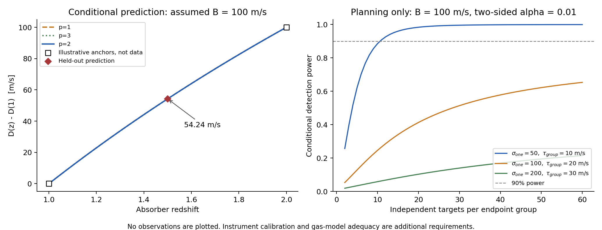

# Fe II 相对频率的前瞻预测实验设计

## Material Passport

- 任务：将作者的对数平方反比宇宙时间设想转化为先预测、后观察、允许失败的检验。
- 状态：2026-09-21形成的**设计稿**；没有公开预注册、获配望远镜时间、新观测结果或冻结的物理信号幅度。
- 依据：已有六目标与ESPRESSO系统检验、原子响应审计、当前ESO仪器文档。所有已经看过的资料属于开发材料，不能重新命名为盲验证样本。
- 新增计算：固定年龄函数、留出预测、完整误差传播规则及假设条件下的功效；不读取或拟合已有天体的位移。
- 范围：两个原子跃迁频率比的变化。不能把它称为完整能级分布或黎曼零点统计的测量。

## 1. 与“先预言、后观测”相同的部分，以及尚缺的一步

我们可以事先写下一个条件预言：**若低、高红移系统之间确有同一种普适变化，且变化遵循固定的对数平方反比时间函数，那么尚未查看的中间红移目标必须落在可计算的位置；同一目标换仪器、观测季节或有效级次，物理结果应保持一致。**

目前理论尚未独立给出Fe II原子响应、漂移方向和绝对幅度。因此这是一项“用开发样本锁定参数、再检验新数据”的预测实验，尚未达到从基础方程独立推出绝对数值的程度。不能将任意选取的100 m/s当作理论预言。

原始“可观测高度／附加不确定度”假说描述的是不确定度标准差。它本身不推出平均能级或线心漂移。本方案明确添加一个可检验的**普适、确定性平均相对频率响应**假设。若作者之后选择检验随机展宽而非平均漂移，需要先独立给出涨落的时间／空间相关和原子响应，另立协议；不能在一个终点失败后改称另一个终点已成功。详见[已有原子响应审计](../highz_feasibility_2026-09-20/reports/atomic_response_audit.md)。

## 2. 一张明确的预言卡

主观测量固定为同一对Fe II线：

\[
D(z)=v_{2382}-v_{2374},\qquad Y_{\rm app}=-D/c.
\]

共同红移被消去。对D的物理解释仍取决于标定、气体、同位素和环境控制；给全部能级相同的分数缩放也可能被红移吸收，不能用本实验排除所有能级变化。

固定参考宇宙学为平坦物质＋宇宙常数模型，\(H_0=67.4\) km/s/Mpc、\(\Omega_m=0.315\)，仅用于年龄坐标，忽略辐射。固定\(t_*=5.391247\times10^{-44}\)秒，\(p=2\)。不能在看到确认集后再优化这些量。定义

\[
f_p(t)=\left[\frac{\ln(t_0/t_*)}{\ln(t/t_*)}\right]^p-1,
\qquad
H_p(z)=\frac{f_p(t(z))-f_p(t(1))}{f_p(t(2))-f_p(t(1))},
\]

\[
D(z)=b+B H_2(z),\quad b=D(1),\quad B=D(2)-D(1).
\]

**本方案B是z=1到z=2的端点差，不是旧方案归一化到z=3的幅度A。** 当前没有测得B，也未由原理论确定B的正负。

| 设计中心 | 参考宇宙年龄 | 用途 | H₂ |
|---|---:|---|---:|
| z=1.0 | 约58.46亿年 | 低红移锚点及独立复验组 | 0 |
| z=1.5 | 约42.64亿年 | 留出预测组 | 0.542436 |
| z=2.0 | 约32.73亿年 | 高红移锚点及独立复验组 | 1 |

因此，**固定该模型时的条件预言**是

\[
\boxed{D(1.5)_{\rm pred}=0.457563556D(1.0)+0.542436444D(2.0)}.
\]

例如，**假如**开发数据经标定后给出高、低组相差+100 m/s，则中间组应比低组高约+54.24 m/s；若端点差为−100 m/s，中间差应约−54.24 m/s。100是演示幅度，54.24也是由它导出的演示预言，均不是已经观察到的宇宙变化。

实际目标不必恰好位于三个中心。正式预测使用各目标实际红移和设计矩阵；若展示分组结果，应平均各目标的H而非将组平均红移直接代入H。目标名单和大气清洁窗口在查看确认位移前冻结。

## 3. 如何实施与留出

### A. 先导与开发

已有17份ESPRESSO曝光和六个候选用于算法、质量筛选和系统误差研究，不算新预言的确认。先导先处理当前最明确的相邻级次差，获取独立的波长和响应约束；不能拿科学谱自行拟合出的响应核当作独立标定。

未来开发样本需要覆盖低、高红移端，并有经过标定的、相同定义的D。只用这些样本估计b、B和必要的干扰参数及其协方差。开发中的气体架构、误差模型、排除规则和选择过程完整保留。若B尚未被约束，便没有足够尖锐的非零预言：可以继续报告灵敏度或上限，不自行指定一个最容易检出的幅度。

### B. 冻结预言

在读取确认集相对位移前，保存并公开带时间记录的：模型及参考尺度、目标ID和分组、选择规则、代码版本、开发数据清单、b/B与预测协方差、主统计量、误差预算、最低关注幅度\(B_{\min}\)、停止规则、仪器和环境对照。当前文件哈希仅用于可复算性，**不是已经完成的公开预注册**。

确认集必须包含新的独立视线；同一视线内多个吸收体的校准误差需共享处理。已经被用于筛选“显著位移”的对象不能进入确认集。可使用独立管理的盲化位移进行方法开发，但不在此文件保存隐藏偏移或假装当前分析已经盲化。

### C. 确认与独立复验

确认样本包含低、中、高三组。中间组检验曲线预报，两个端点的新对象检验变化幅度是否能够重复；仅用旧端点加一个新中点不能完成独立的趋势复验。主检验始终使用2374/2382这一对，2344及可用的2260等只按预定规则帮助约束气体结构。气体、同位素、天空、重采样和像素协方差通过原生曝光前向模型与盲注入验证，注入同时覆盖零响应和非零响应。不能仅因不变模型拟合不足而删除确认目标；拟合失败和不适用对象按预定规则完整报告。

作为预算草案可先考察开发端点各4个独立视线、确认集每组8个的组织方式；这合计32条视线，**只是样本组织示例，没有证明功效足够或目标均存在**。最终样本量由先导总误差及\(B_{\min}\)确定，不能根据显著性逐个追加直到过线。允许预先规定一次只看盲化质量与噪声的样本量调整。

每个红移组都应有跨仪器复测子样本；各组穿插观测季节及夜晚。保留不同BERV、迹线和有效重叠级次的结果，同时尽量匹配吸收深度、速度宽度、饱和与可测环境指标。近红移不同视线控制量化目标间散布。同一个系统跨年份复测主要是仪器检验，不能当作几十亿年的年龄差。

## 4. 误差与判据：怎样才算失败

定义中点闭合量

\[
C=D_M-(1-r)D_L-rD_H,\quad r=0.542436444,
\quad \operatorname{Var}(C)=w^T\Sigma w,
\quad w=(-(1-r),1,-r).
\]

作为冻结预报的检验时，D_L和D_H来自开发锚点（或开发b、B给出的等价预测），D_M来自新的中间目标。用三个确认组另外计算闭合量，是独立形状诊断，不能代替开发阶段冻结的预报，也不能代替新端点的非零趋势检验。

\(\Sigma\)必须包含开发参数、验证数据、共同实验室误差、标定及其交叉协方差。三组独立、均值误差都为σ时，\(\sigma_C=1.226214\sigma\)。共同实验室比值零点取消；波长畸变和年龄相关偏差不自动取消。若每组还可能有绝对值不超过ε的未知偏差，闭合量的最坏偏差可达2ε，不能按对象数开平方消除。

**C=0也满足完全不变的模型，不能单凭“中点落在线上”宣布变化。** 主确认检验须同时检验新的端点样本是否存在非零趋势。当前功效表采用一个预先指定的双侧α=0.01端点对比，只是设计阈值；不是5σ发现标准，也不自动覆盖模型选择和未知系统误差。真实检验分布须经过所采用噪声、气体和标定模型的注入恢复与覆盖率检验；无法校准时只报告条件推断。

| 结果 | 允许的结论 |
|---|---|
| 新端点的非零差异重复出现，中间组与冻结预测相容，仪器／环境控制也通过 | 支持所检验范围内的非零普适响应；相容本身不证明p=2或黎曼起源 |
| 确认集有足够精度，却排除了冻结预测的方向或幅度 | 该次非零预言失败；保留失败结果，不能重新调幅度后称为预测成功 |
| 中间组显著违反含完整误差预算的预报 | 所检验时间形状、普适性或误差模型至少一项失败，先定位原因 |
| 偏移随仪器、迹线、级次或BERV改变 | 该差异的物理归因未通过对照，优先检查系统误差；仪器偏差也可能与真实信号共存 |
| 同龄不同视线的差异占主导 | 先检验环境、气体与残余标定，不能将散布直接称为时间效应 |
| 误差太大，既排除不了零也排除不了冻结预言 | 结论为信息不足，不能将“不拒绝”称为验证成功 |

若希望声称“达到了预言精度”，还须在冻结时给出有物理意义的等效容差并验证区间足够窄，而不是只要求拟合p值大于阈值。由于本家族允许B=0，零结果最多排除冻结的非零预报或有足够功效的\(|B|\geq B_{\min}\)范围，不能推翻允许任意小幅度的整个思想框架。

## 5. 当前能达到什么层级

下表是假设的高斯功效计算，令真正的端点差B=100 m/s，确认的两个端点组各8个独立视线。单目标随机误差可平均；每组共享误差不随样本数下降。表中的每组τ是假设零均值、两端组之间独立、方差已知的高斯随机偏差。组间相关时差分方差还须包含−2Cov；未知的确定性年龄偏差不能套用该功效表。**均为规划输入，不是实测性能。**

| 假设单目标随机σ | 每组共享τ | 端点差误差 | 双侧α=0.01功效 | 达到90%功效所需B |
|---:|---:|---:|---:|---:|
| 50 m/s | 10 m/s | 28.72 m/s | 81.7% | 110.8 m/s |
| 100 m/s | 20 m/s | 57.45 m/s | 20.2% | 221.6 m/s |
| 200 m/s | 30 m/s | 108.63 m/s | 4.9% | 419.0 m/s |

在第一种严格条件下，各端点11个目标可对B=100 m/s达到90%功效；中间组预测、开发参数不确定度、独立复测与非高斯系统效应尚需额外资源。第二、第三情景即使无限增加组内目标，功效也受共享误差限制。这说明独立标定的重要性不能由“数据很多”替代。

更严格的“指数必须等于2”预言，目前不现实：固定同样端点B=100 m/s后，p=1和p=3的中间预报仅比p=2高／低约0.0517 m/s。它们在现有精度下几乎重合。此方案首先验证可重复的非零变化与预先指定的年龄关系，不能包装为平方指数的独有检验。



## 6. 现有设备与实施门槛

ESO当前ESPRESSO科学波段为380–788 nm，HR中位分辨率约140,000；**P117手册给出的当前光梳蓝端约450 nm**。主方案采用z≈1、1.5、2，Fe II线对分别位于约475/477、594/596、712/715 nm。z≈0.7的谱线虽在科学波段内，却低于当前光梳范围，因此不作为主方案。红移中心只是设计示例，z≈2组必须在看位移前排查水汽污染、实际标定质量与天空背景。[ESO模式说明](https://www.eso.org/sci/facilities/paranal/instruments/espresso/overview.html)、[P117手册](https://www.eso.org/sci/facilities/paranal/instruments/espresso/ESPRESSO_User_Manual_P117.pdf)

实际安排优先评估暗类星体的HR＋天空模式。LFC/ThAr是白天标定；不能承诺科学曝光前后的夜间紧接LFC，亦不能让同一根B光纤同时记录天空和FP。需要保存实际标定链并独立量化时间漂移。UVES可提供独立光路复测，但实际设置、波段缺口、分辨率和标定质量须逐目标检查，不能把它当作无误差真值。[ESO UVES参数](https://www.eso.org/sci/facilities/paranal/instruments/uves/inst.html)

近期可以完成目标与标定资格筛选、曝光时间计算、复杂谱线盲注入和预测卡的准备；已有仪器可启动，不必等待宇宙在地面时间尺度上显著变老，也不依赖未来ANDES交付。正式观测时数和最终样本尚未确定，须由真实目标亮度、线强、ETC、标定方案和望远镜时间决定。十年内是否能发现信号还取决于自然界实际幅度，当前不能保证。

## 7. 交付与复现

- [仪器事实核查](reports/instrument_feasibility_cn.md)及[四项ESO来源清单](reports/source_manifest.json)。
- [预测逻辑与交叉协方差独立核查](reports/prediction_logic_review.md)。
- [数值设计、情景参数和14项内部检查](results/design.json)。
- [可导出的设计图PDF](figures/prediction_design.pdf)。

在本目录运行：

```bash
OPENBLAS_NUM_THREADS=1 OMP_NUM_THREADS=1 python code/prediction_design.py
```

代码未使用已有科学位移；年龄由独立Friedmann积分复算，闭合量的常数／幅度消去、共享实验室误差取消及高斯功效关系均通过数值检查。独立逻辑核查另外重算了主要预测系数。这些是设计验证，不是执行了新天文观测。
