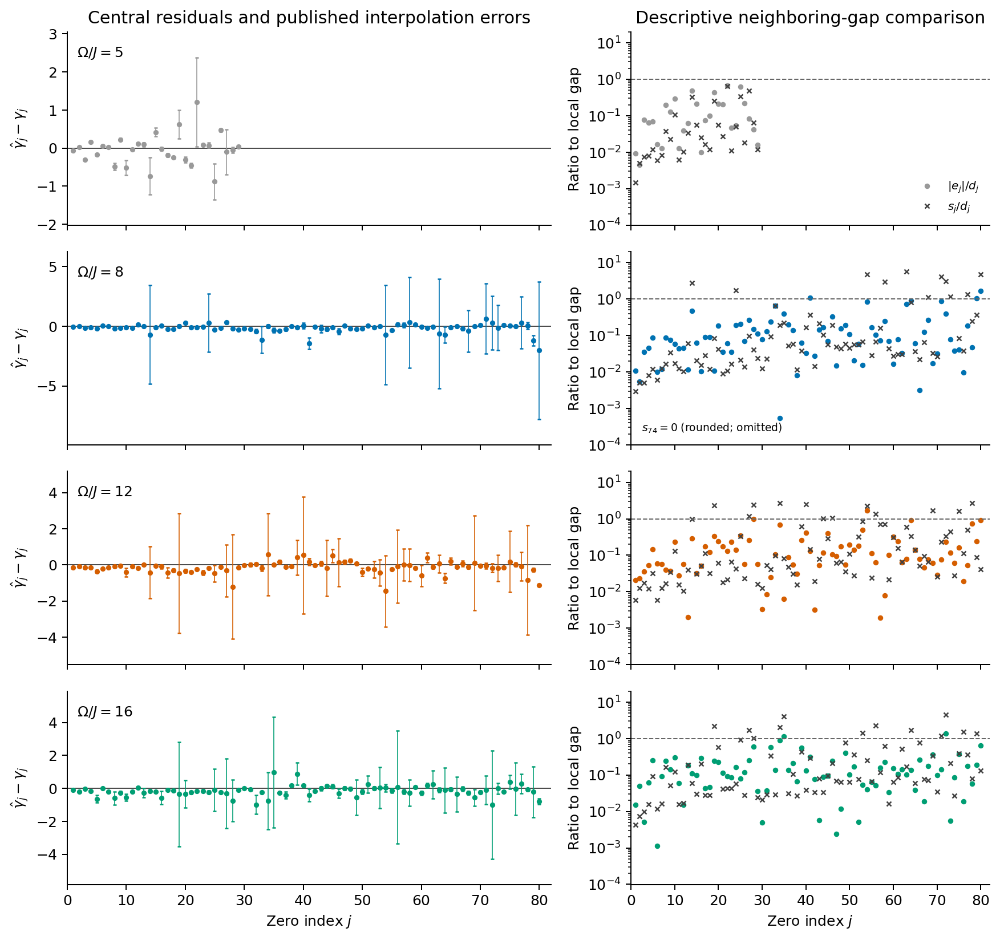
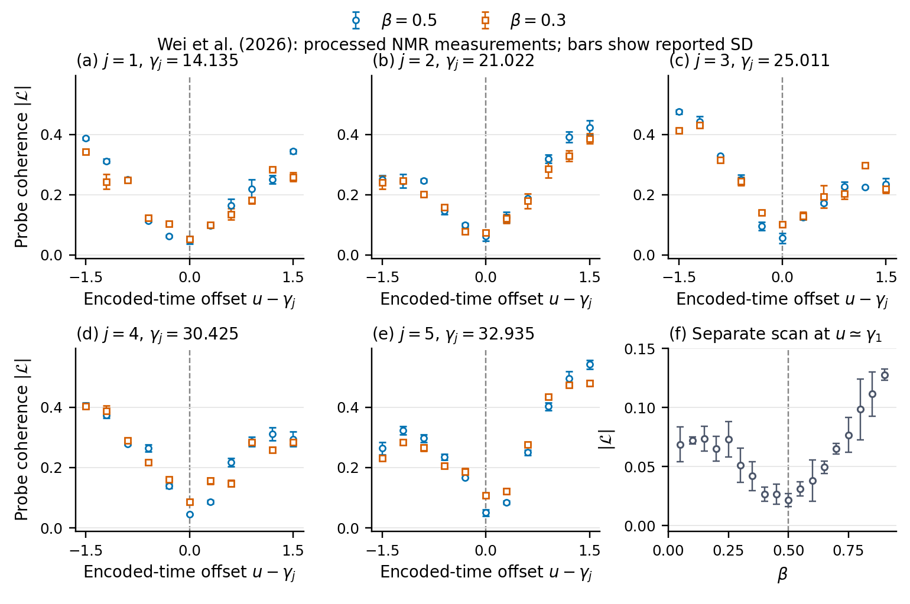
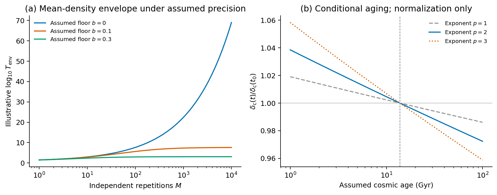
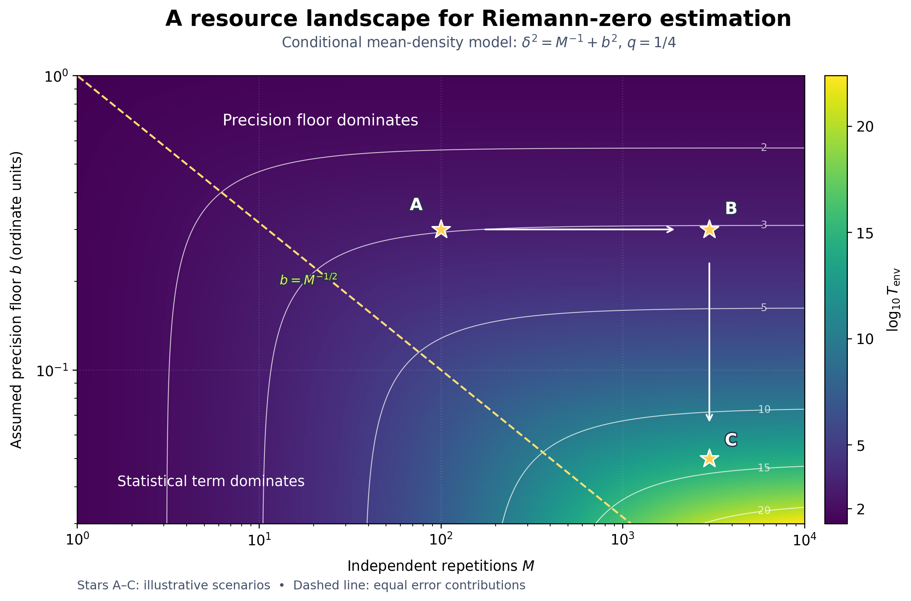
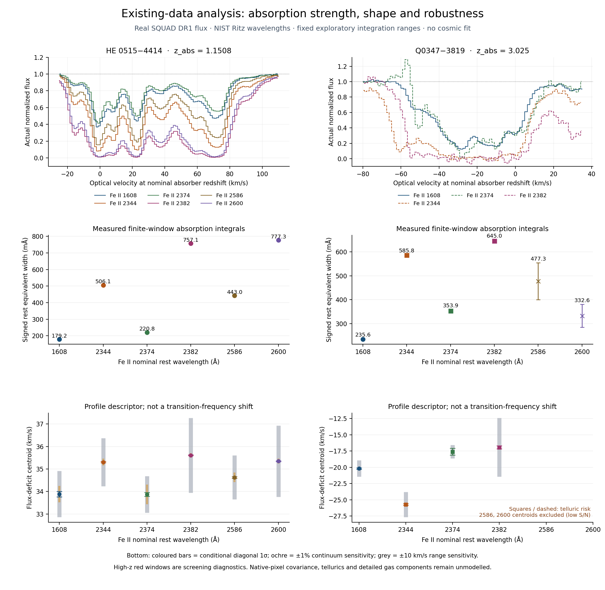
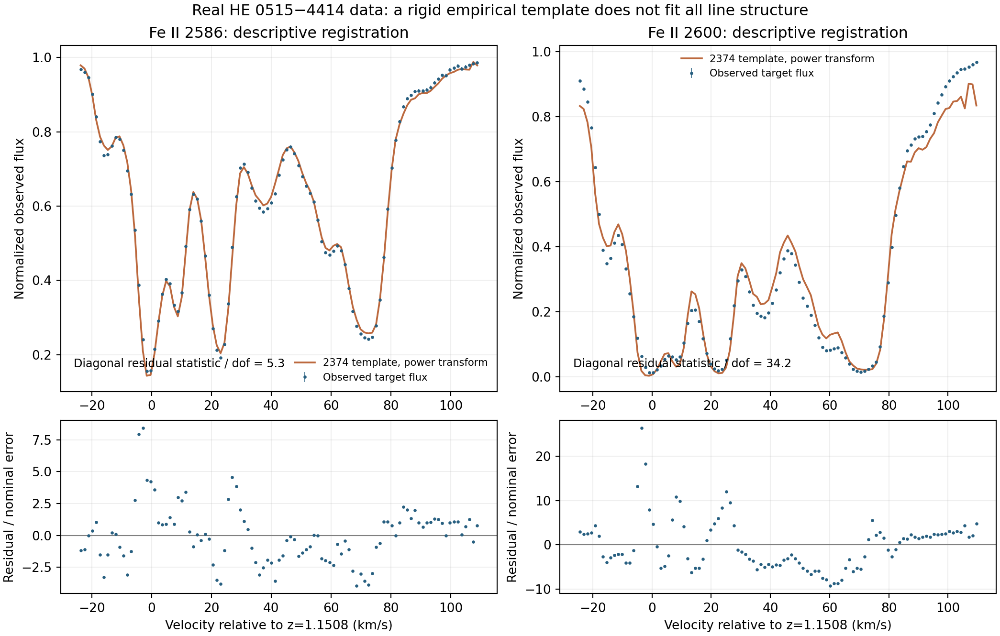

# Riemann Clock

[中文说明](readme_cn.md)

Project repository: [maris205/riemann_clock](https://github.com/maris205/riemann_clock).
Clone using SSH:

```bash
git clone git@github.com:maris205/riemann_clock.git
cd riemann_clock
```

Both manuscript PDFs, processed data and saved fit results are included. See the
[repository contents and recovery guide](reports/repository_contents.md) for
restoring the large third-party raw spectra omitted from Git.

An exploratory study of **finite-resource physical estimates of Riemann zeros**, with a separately stated hypothesis that an additional uncertainty scale may evolve with cosmic age.

The mathematical zeros remain fixed. The proposed time dependence concerns the performance of a specified physical encoding and estimator. Current public experiments do **not** identify a cosmic aging component or a universal maximum observable zero height.

## Manuscript and results

- [Original single-column hypothesis manuscript (35-page PDF)](paper/riemann_clock.pdf)
- [Focused spectroscopy companion (PDF)](paper_spectroscopy/feii_relative_frequencies.pdf)
- [LaTeX source](paper/main.tex) and [theory section](paper/theory_sections.tex)
- [Chinese revision report](reports/revision_report_cn.md)
- [Numerical validation](reports/numerical_validation.md) and [citation checks](reports/citation_checks.md)
- [Internal draft review](reports/draft_internal_review.md)
- [Additional λ-cosmos manuscript comparison (Chinese; proposed additions)](reports/lambda_cosmos_comparison_cn.md)
- [High-redshift data analysis and experiment protocol](experiments/highz_feasibility_2026-09-20/readme.md) (actual flux measurements and registration diagnostics now included in the manuscript; synthetic forecasts remain separately labelled)
- [Existing-data results and observing outlook, Chinese](experiments/highz_feasibility_2026-09-20/reports/existing_data_results_and_outlook_cn.md)

The manuscript is an **author-review draft**, not a submitted or externally reviewed paper. Author declarations remain to be finalized.

## Focused spectroscopy companion

The new [single-column companion](paper_spectroscopy/feii_relative_frequencies.pdf), *Instrument and Gas-Model Sensitivity of Fe II Relative-Frequency Tests in Archival Quasar Spectra*, develops the astronomy analysis as a separate reproducible study. Its [LaTeX sources](paper_spectroscopy/main.tex) cover gas structure, covariance, native exposures, overlapping orders, the screened absorber sample and cross-age identifiability. The original 35-page hypothesis manuscript, laboratory analyses and resource–precision heatmap are preserved. Section 5.4 now summarizes a prospective prediction test; Appendix A gives the fixed time law, independent validation, covariance, failure criteria, conditional power and instrument requirements. This remains a proposed design, with no new observations or frozen physical amplitude. The [full design record](experiments/prediction_test_2026-09-21/prediction_protocol_cn.md) accompanies the paper.

The centred positive asymmetric response control retains a Fe II 2600 order contrast near **−59 m/s**. It does not identify a unique calibration or instrumental mechanism. Common-pair profile calculations also expose lower nuisance-parameter solutions, so older successful optimizer endpoints and their numerical comparisons remain historical stages. Cross-age shape calculations use declared hypothetical amplitudes; they do not measure a cosmic trend or establish a varying constant.

- [Current publication follow-up and results, Chinese](experiments/highz_feasibility_2026-09-20/reports/publication_followup_results_cn.md)
- [Order-response models](experiments/highz_feasibility_2026-09-20/reports/order_response_results_cn.md) and [residual/trace controls](experiments/highz_feasibility_2026-09-20/reports/order_response_residuals_cn.md)
- [Common 2382/2374 descriptor and conditional profiles](experiments/highz_feasibility_2026-09-20/reports/common_pair_results_cn.md)
- [Cross-age identifiability](experiments/highz_feasibility_2026-09-20/reports/cross_age_identifiability_cn.md)
- [Historical calibration availability and remaining requirements](experiments/highz_feasibility_2026-09-20/reports/calibration_readiness_cn.md)

Build the companion from this directory using the saved results and figures:

```bash
python code/build_spectroscopy_paper.py
```

This separate build leaves the original manuscript unchanged. Neither document is described as externally reviewed or accepted.

## Earlier existing-data extension: preserved hypothesis manuscript

The analysis now includes **all 17 individual ESPRESSO exposures**, **32 additional UVES spectra containing 36 screened absorbers**, and actual physical fits for two new systems. Six absorbers pass the automatic multiplet-readiness screen; these are candidates, not six precision measurements. All observations are archival.

Combined empirical covariance and frozen strong-core exclusions give five-shift improvements of **23.69** and **6.70**. The wider mask also removes about 84% of the local information for the specified coherent two-line shift, so the decrease alone does not identify saturation as the cause. A fixed 40-component gas alternative gives 18.87 and exposes initialization sensitivity. In individual exposures, the same Fe II 2600 transition differs by about **60 m/s between adjacent orders**, remaining about 58 m/s with fitted Gaussian widths. This motivates additional calibration, extraction and template checks without locating the cause of all original offsets.

The two new absorber pilots are already adequately described by their selected conventional models. Re-fitting with SQUAD's recommended expected-fluctuation errors gives **Δχ² = 6.16 / four shifts** and **5.50 / two shifts**. No physical-constant variation or inverse-log-squared cosmic-time law is established. The strict UVES continuation audit also retains capped, nonstationary endpoints explicitly.

- [Complete campaign results, Chinese](experiments/highz_feasibility_2026-09-20/reports/available_data_campaign_results_cn.md)
- [Combined controls and information figure](figures/joint_controls_information.png)
- [Individual-exposure and order diagnostic](experiments/highz_feasibility_2026-09-20/results/exposures/exposure_consistency.png)
- [Archive multiplet-readiness heatmap](experiments/highz_feasibility_2026-09-20/results/archive_expansion/archive_line_readiness.png)
- [Two new physical fits](experiments/highz_feasibility_2026-09-20/reports/archive_profile_results_cn.md)
- [Final PDF and delivery verification](reports/available_data_delivery_verification.md)

The manuscript incorporates this extension. Earlier analysis stages below remain documented separately; the laboratory figures and resource–precision heatmap are retained.

## Primary hypothesis

For a specified protocol, a possible additional standard-deviation component is

```math
\delta_{\mathrm c}(t)=\delta_{\mathrm c0}
\bigg[\frac{\ln(t_0/t_{\ast})}{\ln(t/t_{\ast})}\bigg]^2,
\qquad t>t_{\ast},\quad \delta_{\mathrm c0}\geq0.
```

The logarithm has a dimensionless argument. The amplitude, reference scale, physical response, and averaging behavior require independent specification. The null model permits zero amplitude. The form is motivated by [Wang's published non-autonomous quadratic-map study](https://doi.org/10.3390/mca31050193); transferring its iteration-dependent structural parameter to cosmic-age-dependent measurement uncertainty is an **additional assumption**. Numerical spectral correspondence is not a demonstrated isomorphism or a Hilbert–Pólya Hamiltonian.

With an illustrative age of 13.8 Gyr and a Planck-time reference scale, the proposed component changes fractionally by approximately **−1.03 × 10⁻¹² per year**. This is a conditional calculation, not a measurement or a fit to the experimental data.

## Public evidence

| Source | Included material | Interpretation |
|---|---|---|
| [He et al., npj Quantum Information 7, 109 (2021)](https://doi.org/10.1038/s41534-021-00446-7) | 269 published estimates across four drive settings, covering the first 80 zero indices | Interpolation errors are not complete systematic uncertainties; no common endpoint breakdown is established. |
| [Wei et al., Nature Communications 17, 8163 (2026)](https://doi.org/10.1038/s41467-026-74935-8) | 110 processed time-scan points, 18 processed inverse-temperature-scan points, and five reported root estimates | Five-qubit NMR experiment near the first five zeros; high-index examples are numerical simulations. |

The second paper was formally published on July 1, 2026; its preprint first appeared in November 2025. These different platforms cannot be combined into a cosmic-time series. The 128 processed NMR points are not additional independent root measurements or raw acquisition shots.

The zero index and ordinate are distinct: the 80th ordinate is approximately **201.264752**. The old cutoff near 4200 and waiting-time prediction are not retained as physical results.

## Actual astronomical-data analysis

Two archived SQUAD spectra, at reference absorber redshifts 1.1508 and 3.025, are now analyzed using their actual observed flux. The extension reports finite-window equivalent widths, flux-deficit centroids, continuum/interval sensitivity, and empirical Fe II profile registration. It uses archived NIST Ritz wavelengths and preserves contamination and low-S/N flags.

The analysis demonstrates why a small statistical error is insufficient for a physical shift claim: the integrated descriptors depend on profile weighting, the simpler registration models fail on parts of the real profiles, and the high-redshift example lacks a validated differential line set. No cosmic coefficient or Riemann cutoff is inferred. The observing outlook follows these measured limitations; prior identical-line forecasts remain prospective scenarios.

## Figures









The scenario figures use deliberately assumed parameters. The heatmap shows how repetitions and an assumed precision floor change the mean-density envelope; its stars are illustrative scenarios. These figures are not empirical calibrations of the cosmic hypothesis.





## Reproduce locally

Python dependencies are listed in [requirements.txt](requirements.txt). `pdftotext` is needed for the supplementary-table extraction. PDF compilation requires a TeX installation with `pdflatex`, `bibtex`, and REVTeX 4.2.

From this directory:

```bash
python code/extract_public_experiments.py
python code/analyze_zero_precision.py
python code/plot_recent_experiment.py
python code/plot_resource_heatmap.py
python code/validate_analysis.py
python code/build_paper.py
```

These commands use the included source snapshot and require no network connection. The mathematical reference CSV is cached; remove only `data/processed/mathematical_reference_zeros.csv` to recompute it at 35 decimal digits. The validator independently recomputes references at higher precision. Numerical values are not presented as new interval-certified enclosures. Downloaded upstream Python files are retained as source documentation and are not executed by these commands.

To regenerate the added astronomy results and manuscript inputs, use the experiment directory's dependencies and run:

```bash
python experiments/highz_feasibility_2026-09-20/code/measure_observed_profiles.py
python experiments/highz_feasibility_2026-09-20/code/register_observed_profiles.py
python experiments/highz_feasibility_2026-09-20/code/design_from_observed_data.py
python experiments/highz_feasibility_2026-09-20/code/prepare_highz_manuscript.py
python code/build_paper.py
```

## Layout and provenance

- `data/raw/`: primary supplements, publisher snapshots, and selected author data files.
- `data/processed/`: source-preserving transcriptions and derived diagnostic CSV files.
- `data/source_project/`: unchanged source copies, hashes, and code-only notebook extracts from the original local project.
- `code/`: deterministic extraction, analysis, plotting, validation, and compilation.
- `results/`: machine-readable summaries, scenarios, and environment versions.
- `figures/`: PDF and PNG scientific figures.
- `paper/`: manuscript sources, bibliography, and compiled PDF.
- `reports/`: source audits, corrections, review scope, and validation records.

The 2026 author repository is pinned to commit `a8b0b38202d6f330297212f8755c8df04242f9d6`; its included [license](data/raw/wei2026/LICENSE) is preserved. Other third-party files retain their original rights and attribution. The source project under `Cosmic-Chaos-Alpha` was read without modification. No empirical figure uses the original project's synthetic error generator.

AI assistance was used for this draft and its analysis. Internal checks do not constitute external peer review or a claim that the human author has read or approved every source.

## Earlier stage: conventional absorption baseline

A separate joint Voigt analysis now uses the public ESPRESSO spectrum of the same low-redshift absorber. Six Fe II lines and 2,931 valid pixels are fitted with 45 shared gas components. Adding five relative line shifts improves the primary statistic by **Δχ² = 51.71**, mainly involving strong lines 2382 and 2600. Several model/noise controls retain a conditional preference; excluding those two lines reduces it to 7.09 for three shifts. This is a model-dependent residual consistency issue, not a confirmed physical-constant variation or a cosmic-time-law measurement.

The [detailed report](experiments/highz_feasibility_2026-09-20/reports/conventional_null_results_cn.md), [actual physical fit](figures/espresso_conventional_null.png), [robustness figure](figures/espresso_null_robustness.png), and [reproduction commands](experiments/highz_feasibility_2026-09-20/readme.md#espresso-conventional-null-test) document the completed tests and their limits. The new section and comparison table are included in the single-column manuscript; the resource heatmap and earlier laboratory results are retained.

## Earlier stage: separate covariance, core and UVES controls

Twenty-five disjoint continuum intervals (13,750 pixels) show a lag-one correlation of **0.373**. A new constrained nonlinear fit under a fixed, tapered empirical covariance reduces the five-shift improvement from 51.71 to **29.24**. Separate frozen masks removing the darkest strong-line cores or wider padded cores give **41.66** and **13.26**. The covariance and masking changes are separate controls, not their simultaneous application.

The same absorber is also fitted in UVES, where instrumental-width uncertainty, active bounds and local-solution dependence limit independent confirmation. The present conclusion remains a conditional relative-line inconsistency, with no established physical-constant variation or fitted cosmic-time law.

- [Follow-up results and interpretation (Chinese)](experiments/highz_feasibility_2026-09-20/reports/conventional_followup_results_cn.md)
- [Continuum correlation and actual nonlinear re-fits](figures/espresso_noise_controls.png)
- [UVES comparison and limitations](experiments/highz_feasibility_2026-09-20/reports/cross_instrument_results_cn.md)

The July 2026 [HARPERFECT preprint](https://arxiv.org/abs/2607.06809) describes a relevant new extraction of historical HARPS exposures. Science arrays and associated resolution matrices were not located in the channels checked here; no HARPS re-fit is claimed.
